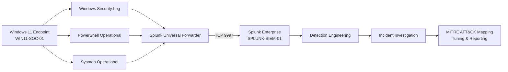

# SOC Home Lab — Detection Engineering & Incident Investigation

A practical blue-team portfolio project built to demonstrate end-to-end SOC analyst workflow: endpoint telemetry collection, SIEM ingestion, detection engineering, cross-source investigation, MITRE ATT&CK mapping, false-positive tuning, and incident reporting.

> **Lab scope:** isolated personal training environment. All incidents in this repository are controlled simulations. No employer, production, or third-party systems were tested.

## Project Highlights

- Built a Windows 11 endpoint monitoring lab in VMware Workstation.
- Enabled and validated Windows Security process/authentication telemetry, PowerShell Operational logging, and Sysmon.
- Deployed Splunk Enterprise on Ubuntu Server and Splunk Universal Forwarder on the Windows endpoint.
- Validated end-to-end ingestion into a dedicated `soc_lab` index.
- Built three behavior-oriented detections and validated each against controlled test data.
- Reconstructed incidents using Windows Security, Sysmon, and PowerShell telemetry rather than relying on a single alert source.
- Tuned detections with analyst context instead of blanket allowlisting.
- Produced three final incident reports.

## Lab Architecture



**Core stack:** VMware Workstation, Windows 11 Enterprise Evaluation, Ubuntu Server 24.04 LTS, Splunk Enterprise 10.4.1, Splunk Universal Forwarder 10.4.1, Sysmon 15.21, Windows Event Logging, PowerShell Script Block / Module Logging.

## Detection Engineering

| ID | Detection | Primary telemetry | Validation |
|---|---|---|---|
| [DET-001](detections/DET-001-multiple-failed-logons.md) | Multiple Failed Logons | Windows Security 4625 | Validated |
| [DET-002](detections/DET-002-encoded-powershell.md) | Encoded PowerShell Execution | Sysmon Event ID 1 | Validated |
| [DET-003](detections/DET-003-powershell-spawned-command-shell.md) | PowerShell Spawned Command Shell | Sysmon Event ID 1 | Validated |

The rules in this repository are **lab validation rules**, not production thresholds. Each detection file documents its assumptions, enrichment fields, validation evidence, false-positive considerations, and production caveats.

## Incident Investigations

| Incident | Trigger | Final disposition | Report |
|---|---|---|---|
| [INC-001](incidents/INC-001-multiple-failed-logons.md) — Multiple Failed Logons | DET-001 | Benign / Controlled Simulation | [PDF](https://drive.google.com/file/d/1bSTT2z9DcXB5FNRJPQ2xuURTn2rndlhV/view) |
| [INC-002](incidents/INC-002-suspicious-powershell.md) — Encoded PowerShell Analysis | DET-002 | Benign / Controlled Simulation | [PDF](https://drive.google.com/file/d/1m7nk2CjX5LmBShaKAj9_iaKSd9DwJhUP/view) |
| [INC-003](incidents/INC-003-suspicious-process-execution.md) — Suspicious Process Execution | DET-003 | Benign / Controlled Simulation | [PDF](https://drive.google.com/file/d/1lCsrshQINoS5y0iuMYgRtGRS_eTuiVhI/view) |

## What the Investigations Demonstrate

### INC-001 — Authentication Triage

A burst of Windows Security Event ID 4625 failures was detected using a rolling five-minute threshold. Investigation separated the **target account** from the calling account, evaluated `Status` / `Sub_Status`, classified the source as local loopback, and correlated the failures with PowerShell credential-rejection telemetry. The alert was resolved as a controlled simulation with high confidence.

### INC-002 — Encoded PowerShell

An encoded PowerShell execution was detected from Sysmon process creation. The investigation correlated Windows Security 4688, Sysmon Event ID 1, and PowerShell 4104 to distinguish the encoded command line from the decoded script-block content. The decoded payload was benign, demonstrating why encoding alone should trigger triage rather than an automatic malicious verdict.

### INC-003 — Process Tree Reconstruction

A PowerShell process spawning `cmd.exe` triggered DET-003. Sysmon `ProcessGuid` / `ParentProcessGuid` correlation reconstructed the lineage from PowerShell to the command shell and its discovery utilities. Windows Security 4688 and PowerShell 4104 provided independent confirmation of the same execution chain.

## MITRE ATT&CK Coverage

- **T1110.001 — Password Guessing**
- **T1059.001 — PowerShell**
- **T1059.003 — Windows Command Shell**
- **T1033 — System Owner/User Discovery**
- **T1082 — System Information Discovery**
- **T1016 — System Network Configuration Discovery**

ATT&CK mappings describe observed behaviors in the controlled lab and do not imply that the test activity was malicious.

## Repository Structure

```text
soc-home-lab/
├── README.md
├── detections/
│   ├── DET-001-multiple-failed-logons.md
│   ├── DET-002-encoded-powershell.md
│   └── DET-003-powershell-spawned-command-shell.md
├── incidents/
│   ├── INC-001-multiple-failed-logons.md
│   ├── INC-002-suspicious-powershell.md
│   └── INC-003-suspicious-process-execution.md
└── docs/
    ├── architecture.md
    └── lab-environment.md
```

## Engineering Principles Used

- Evidence first: observed telemetry is separated from assumptions.
- Cross-source correlation before final disposition.
- Process lineage uses identifiers such as `ProcessGuid` / `ParentProcessGuid`, not timestamp proximity alone.
- Detection signals are treated as investigation triggers, not automatic verdicts.
- False-positive tuning adds context before exclusions.
- Failed experiments and troubleshooting are preserved in the engineering journal rather than hidden.

## Status

**Core SOC lab: complete.** Windows telemetry, Splunk ingestion, three detections, three investigations, false-positive/context tuning, and final incident reports have been validated in the isolated lab environment.
