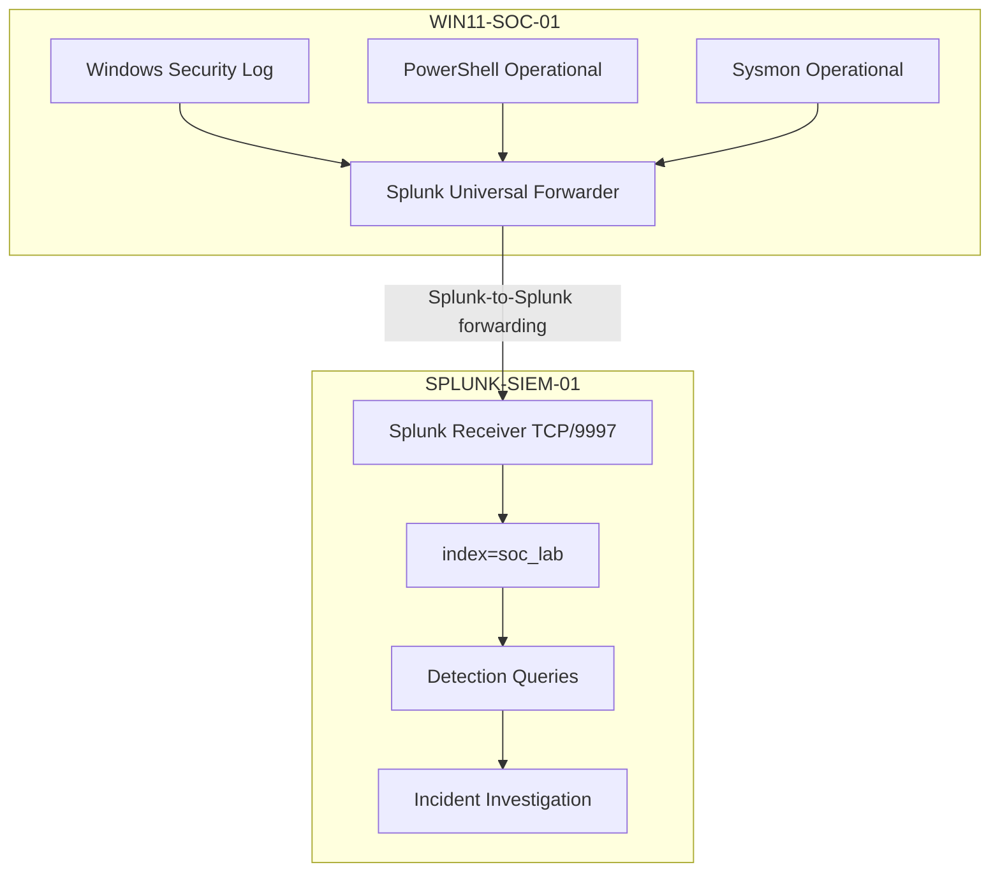

# SOC Home Lab Architecture

## Purpose

This lab separates endpoint telemetry generation from SIEM analysis so detections can be validated across multiple Windows data sources in a controlled environment.

## Logical Flow



## Endpoint

**WIN11-SOC-01**

- Windows 11 Enterprise Evaluation.
- Windows Security authentication and process-creation auditing.
- Command-line process auditing enabled.
- PowerShell Script Block Logging and Module Logging enabled.
- Sysmon 15.21 with schema 4.91.
- Splunk Universal Forwarder 10.4.1.

Validated telemetry includes:

- Windows Security Event IDs 4625 and 4688.
- PowerShell Operational Event IDs 4103 and 4104.
- Sysmon Event ID 1 — Process Create.
- Sysmon Event ID 3 — Network Connect.
- Sysmon Event ID 11 — File Create.

## SIEM

**SPLUNK-SIEM-01**

- Ubuntu Server 24.04 LTS.
- Splunk Enterprise 10.4.1.
- Splunk Web on TCP/8000.
- Splunk receiving port on TCP/9997.
- `soc_lab` index for Windows security telemetry.

## Network Boundary

The environment runs on a controlled VMware NAT network. The Windows endpoint and Splunk SIEM communicate inside the lab subnet; Internet connectivity is only used for controlled software/package acquisition and is not part of an attack target surface.

## End-to-End Validation

The ingestion pipeline was validated as:

```text
Windows telemetry
    ↓
Splunk Universal Forwarder
    ↓ TCP/9997
Splunk Enterprise receiver
    ↓
index=soc_lab
    ↓
Search / detection / correlation
```

A controlled freshness marker was observed across Windows Security, Sysmon, and PowerShell telemetry, confirming that the same activity could be correlated across multiple source families in Splunk.

## Investigation Model

1. Generate or observe endpoint activity.
2. Confirm telemetry locally where necessary.
3. Validate searchable SIEM ingestion.
4. Apply a behavior-oriented detection.
5. Pivot to surrounding telemetry.
6. Build a timeline or process tree.
7. Map observed behavior to MITRE ATT&CK.
8. Determine severity, scope, confidence, and disposition.
9. Document false positives and tuning opportunities.

## Architecture Source

The detailed architecture was maintained separately in Draw.io during the engineering phase. The repository uses this simplified recruiter-facing representation so the core telemetry and investigation flow can be understood quickly.
